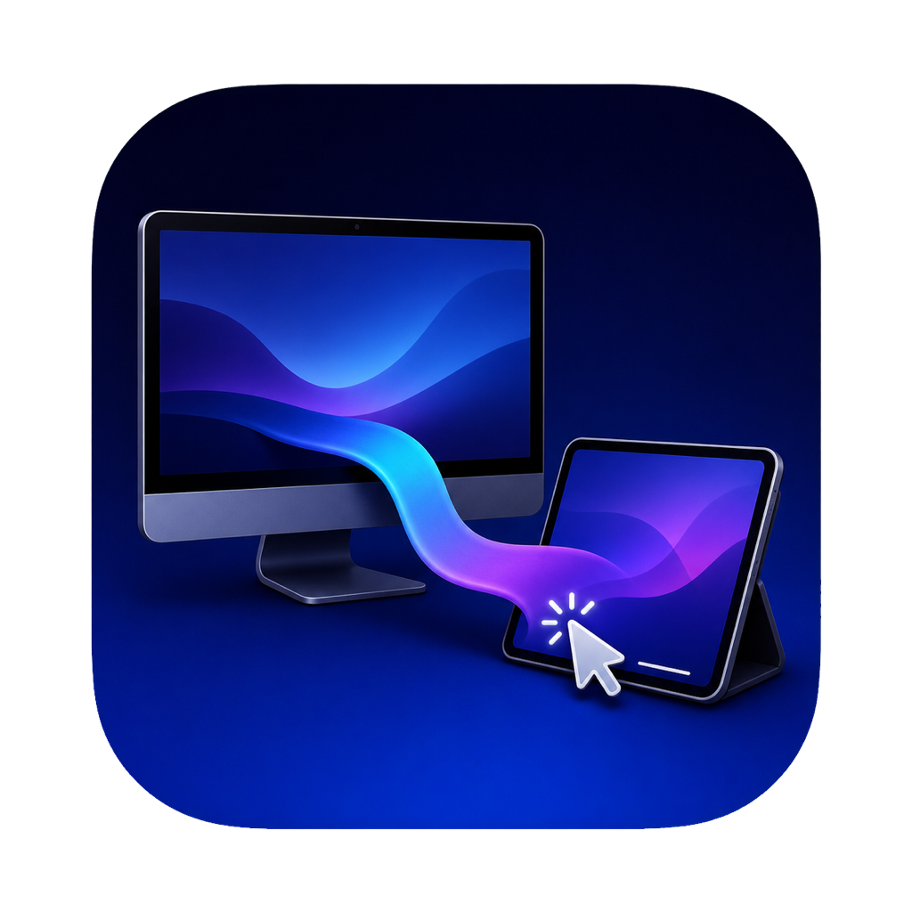

# SidecarBridge

<p align="center">
  
</p>

<p align="center">A secure remote window into your Mac, with iPhone and iPad keyboard, trackpad, and touch input.</p>

<p align="center">
  <a href="https://apps.apple.com/app/sidecarbridge/id6792298083">
    
  </a>
  
</p>

For the full architecture, protocol, permission, distribution, testing, and troubleshooting reference, see [SIDECARBRIDGE_TECHNICAL_GUIDE.md](SIDECARBRIDGE_TECHNICAL_GUIDE.md). The current accessibility support matrix is in [ACCESSIBILITY.md](ACCESSIBILITY.md).

SidecarBridge is a paired macOS + iOS/iPadOS app that turns an iPhone or iPad into an encrypted local Mac display and input surface.

## App Store

- **macOS:** [Download SidecarBridge from the Mac App Store](https://apps.apple.com/app/sidecarbridge/id6792298083)
- **iOS/iPadOS:** [Download SidecarBridge from the App Store](https://apps.apple.com/app/sidecarbridge/id6792298083)

The universal iOS/iPadOS app has passed App Store review and is available from the same multi-platform listing. The current 1.1 update is under review with macOS build 62 and iOS/iPadOS build 71.

On macOS, optional **Shutdown Handoff** keeps an active remote-control session alive while other user apps close during logout, restart, or shutdown. If another app still needs attention, or the remote connection is lost, SidecarBridge cancels the termination request instead of disappearing and leaving the Mac uncontrollable. macOS limits graceful termination delays to under two minutes, so the hold is capped at 105 seconds.

Automatic startup uses the supported macOS Login Item service and therefore begins only after the user signs in. An App Store app cannot run its screen-capture and Accessibility-controlled remote session at the FileVault or macOS login window.

When either app starts, it uses this order:

1. Wait for SidecarBridge on iPhone or iPad to report its selected display mode.
2. By default, discover the Mac directly with Bonjour and stream over an encrypted local-network or AWDL connection. This stays inside SidecarBridge and does not open Apple's Continuity/Sidecar screen.
3. If direct LAN is unavailable, retain Multipeer Connectivity as the nearby/peer-to-peer fallback.
4. On iPad only, never launch native Sidecar automatically. The separate system Sidecar session starts only after the user explicitly clicks **Open System Sidecar**.
5. Keep a button to open Apple's Displays settings when manual intervention is needed.

The in-app stream first uses Network.framework Bonjour discovery across the local network and Apple peer-to-peer link technologies. It immediately retries the last successful private Mac address while discovery runs, and starts Multipeer Connectivity as a nearby fallback after 0.75 seconds. Every route performs ephemeral Curve25519 key agreement and encrypts screen/input packets with direction-separated ChaChaPoly keys and replay-protected counters. A new device enters the Mac's rotating 16-digit, five-minute pairing code; both devices prove the secret with role-separated HMACs before any app data is accepted. Successful verification issues a random 256-bit trusted-device credential stored in the Data Protection Keychain, so later connections do not ask again. Encrypted heartbeats verify the active route every three seconds, show measured round-trip latency in both apps, and rebuild stale sessions automatically. It is intentionally local/nearby only; this project does not publish the Mac screen to the public Internet or require an Internet connection.

Both endpoints must run the same current SidecarBridge build. The secure LAN record layer intentionally rejects older protocol versions instead of silently downgrading to an insecure transport; if either endpoint is older, the iPad reports that both apps must be updated together. Existing pre-migration credentials are copied from the legacy Keychain into the protected Keychain on first read on either platform. If a saved credential is genuinely stale, it is removed only on the iPad after the Mac rejects it, and the Mac's displayed one-time code repairs and replaces that single device credential.

## Build and install

Requirements: Xcode 16 or newer, XcodeGen, macOS 14+, and iOS/iPadOS 17+.

```sh
./scripts/build.sh
/Volumes/D/Xcode.app/Contents/MacOS/Xcode \
  /Volumes/D/github/sidecarbridge/SidecarBridge.xcodeproj
```

In Xcode:

1. Select the `SidecarBridgeMac` target, choose your Apple development team, then run it on **My Mac**.
2. Select `SidecarBridgePad`, choose the same or another valid development team, then run it on an iPhone or iPad.
3. Accept **Local Network** on both devices.
4. The first time a device finds the Mac, enter the Mac app's 16-digit one-time code on the iPhone or iPad. SidecarBridge mutually authenticates LAN and nearby P2P, saves a device-specific Keychain credential, and rotates the code, so later connections do not ask again.
5. If the fallback is needed, grant **Screen Recording** to SidecarBridge on the Mac, quit it, and reopen it.

For automatic startup, use the **Automatic startup** card in the Mac app. It distinguishes enabled, disabled, and macOS-approval-required states. If the app was moved or rebuilt after startup was enabled, click **Repair** once so the Login Item points to `/Volumes/D/Applications/SidecarBridge.app` instead of an old Xcode build.

For reliable native Sidecar, both devices should use the same Apple Account with two-factor authentication. Wireless Sidecar also needs Wi-Fi, Bluetooth, and Handoff; USB Sidecar needs the iPad to trust the Mac.

The in-app direct stream does not use a raw USB socket. A cable can help only when macOS exposes a network route or when the user explicitly starts Apple's separate native Sidecar session; it does not make the SidecarBridge LAN listener reachable by itself. The app therefore reports a cable-only failure as a transport/route issue rather than treating the cable as proof of authentication.

If the app reports `NoAuth`, macOS or iOS/iPadOS has denied Local Network access. Use the app's **Allow Local Network** button and enable SidecarBridge in the system privacy page. Bonjour discovery cannot operate until this Apple-controlled permission is granted.

### iPhone support

The current mobile target is universal (`TARGETED_DEVICE_FAMILY = 1,2`). iPhone provides the encrypted in-app display, touch input, discovery, settings, file transfer, zoom, and background Picture in Picture controls. Apple System Sidecar is an iPad-only feature, so SidecarBridge hides that mode on iPhone instead of presenting a control that cannot work.

## What is and is not possible

Apple's native Sidecar stream cannot be embedded inside a third-party iPad app. iPadOS presents it through Apple's separate Sidecar system app and suspends the native session when the user switches to another iPad app. SidecarBridge therefore keeps **In-App Display** and **System Sidecar** as honest, separate modes.

Apple does not publish a third-party API that starts a Sidecar session. The App Store build therefore opens the public Displays settings UI and never loads private Sidecar frameworks.

The code automatically falls back instead of trying to bypass iPadOS security:

- `SidecarConnector` opens Apple's public Displays settings UI.
- `ScreenStreamer` uses Apple's public ScreenCaptureKit API.
- `MacLANService` and `PadLANService` use Bonjour plus Network.framework so the paired apps can connect on the same Wi-Fi even if Apple's Sidecar device list is empty. If a router filters Bonjour multicast, the iPad first retries the last successful private Mac address and then performs a bounded private-`/24` probe for SidecarBridge's fixed encrypted port `45454`.
- The two apps use an encrypted Multipeer Connectivity session and remember each approved iPhone or iPad by its stable app device identifier for automatic reconnection.

The fallback is a hardware-encoded H.264 HiDPI stream sized from the iPad's native display width (clamped to 1440–2880 pixels, up to 40 fps on the direct route) with remote keyboard, trackpad, touch, and Apple Pencil input. Direct video advances on Network.framework send completion instead of one full app-level round trip per frame. Nearby video also avoids per-frame reliable receipts, so reverse-path latency cannot stall capture. Capture buffering is limited to two surfaces; the encoder emits one periodic keyframe per second and immediately requests another when a transport discards a dependency chain. JPEG packets remain supported for compatibility. It mirrors the main display rather than creating a true extra macOS display. Native Sidecar remains the preferred path for a true virtual Retina display, native Apple Pencil behavior, audio, and extended-desktop support.

Closing the Mac window leaves SidecarBridge available as a background app and in the menu bar so an iPad can reconnect. The menu-bar menu exposes one-click stream start/stop, multi-file sending, the transfer folder, diagnostics, display settings, and the connection state without reopening the main window. On iPadOS, the live stream can be presented in the system Picture in Picture viewer when supported. SidecarBridge is a silent screen viewer and does not declare or provide persistent background audio. A PiP watchdog clears stuck starts and retries them, while the Mac lowers the background stream to 15 fps to reduce congestion and restores normal quality in the foreground. On return, the iPad verifies the encrypted session and rebuilds discovery if it was suspended. If PiP is unavailable, disabled, or closed, SidecarBridge only has iPadOS's short background-task grace period; no ordinary iPad app can run indefinitely outside an Apple-approved background mode.

### Magic Keyboard and trackpad

Apple supports typing with a Smart Keyboard or Magic Keyboard connected to the iPad during native Sidecar, but specifies a mouse or trackpad connected to the **Mac** (or Apple Pencil on iPad) for pointing. SidecarBridge defaults to **Use app stream for Magic Keyboard + trackpad** and forwards:

- 120 Hz-capable trackpad hover/pointer movement, immediate left-button down/up, press-and-hold, double-click, right click, click-and-drag, phase-aware continuous trackpad scrolling, mouse-wheel scrolling, and two-finger touch scrolling;
- immediate one-finger cursor movement, tap/double-tap clicks, hold-then-drag, plus separate Apple Pencil taps and drag input;
- text, arrows, Return, Tab, Escape, Delete, and common Command shortcuts.

The input pipeline preserves Option, Shift, and Option–Shift modifier flags across pointer down, drag, and release events, so modifier-click workflows such as opening a link in a new tab or extending a selection behave like a local trackpad. Shortcuts are sent from the iPad's connected keyboard or trackpad input; the Mac interface does not add a separate shortcut palette. macOS requires the user to authorize SidecarBridge in **System Settings → Privacy & Security → Accessibility** before remote input can be injected.

Remote input requires macOS's permission to post events for SidecarBridge. macOS does not allow an app to add or authorize itself. In the Mac app, click **Allow Remote Input** and accept the native prompt; if macOS opens **Privacy & Security → Accessibility**, click `+` and select SidecarBridge (use **Show App** if needed). The app checks the dedicated PostEvent grant separately from optional Accessibility text insertion, because Apple treats those as separate TCC services. Input events are accepted only through the already encrypted, paired app session.

The iPad viewer forwards a trackpad or mouse primary button-down immediately, keeps it down for stationary long presses, and releases it only when the physical button is released. It captures UIKit's original physical-button mask and precise pointer location, rejects ambiguous button chords instead of guessing, and excludes drags or long holds from the next double-click sequence. A second valid nearby click carries macOS click-state 2 for a true double-click. Secondary clicks remain right clicks. The right-edge viewer drawer also exposes clearly labeled **Left**, **Double**, and **Right** buttons that act at the current Mac pointer position.

Continuous pointer, drag, and scroll samples are coalesced before encrypted transmission: when the link is busy, SidecarBridge keeps the newest cursor/drag location and accumulated scroll distance instead of queueing stale motion. Button-down, button-up, click, scroll begin/end, and keyboard events remain ordered barriers. This keeps control responsive during momentary Wi-Fi or peer-to-peer congestion without losing press-and-hold state.

Finger input does not share the delayed tap recognizers used by Apple Pencil. Touch-down leaves the Mac cursor where it is, and one-finger movement sends relative deltas so the finger behaves like a trackpad instead of teleporting the cursor beneath the touch. Touch-up clicks at the current cursor when the finger stayed within the tap tolerance. A second nearby tap carries macOS click-state 2 without delaying the first click. Holding still for 0.22 seconds starts a drag at the current cursor, then relative movement drags until release. Adding a second or third finger cancels the one-finger pointer gesture so scrolling, zooming, and viewport panning do not create accidental clicks.

### Viewer zoom and file transfer

- Move one finger to position the Mac cursor; tap to click, double-tap to double-click, or hold briefly and then move to drag.
- Swipe with two fingers to scroll the remote Mac.
- Pinch with two fingers to zoom the viewer from 100% to 400%.
- Drag with three fingers to pan while zoomed. Pointer and click coordinates are translated through the zoom so they continue to target the visible Mac content.
- Use the right-edge drawer's zoom buttons to step in, step out, or reset to 100%.

Files can move in either direction over the active encrypted same-Wi-Fi/AWDL or nearby P2P session. Transfers use 128 KB acknowledged chunks, preserve video/input responsiveness, and are limited to 512 MB. The Mac can queue multiple selected files, cancel the active transfer, and show live byte progress, transfer rate, and ETA. A completed transfer is exposed only after its SHA-256 digest is verified and its hidden partial file is atomically renamed. Files received by the Mac are saved in the app's private `Application Support/SidecarBridge/Transfers` folder; files received by the iPad can be exported with **Share Received**. An idle transfer now has a 45-second recovery window so slower local links are not canceled prematurely.

### System information and diagnostics

Both apps show local system information including OS version, hardware model, architecture, active CPU cores, memory, available storage, thermal state, Low Power Mode, uptime, and SidecarBridge version/build. After authentication, each device exchanges its bounded snapshot through the existing encrypted control channel so the iPhone or iPad can show the connected Mac and the Mac can show the connected mobile device.

The iPhone/iPad detail sheet also shows the current route, heartbeat latency, decoded stream dimensions and frame rate, input acknowledgement latency, and Picture in Picture state. It remains available from the right-edge viewer drawer while streaming. **Copy Diagnostic Report** produces a support-ready text report that excludes pairing codes, credentials, stable device identifiers, IP addresses, and file paths.

## Research

- [Apple: Use your iPad as a second display for your Mac](https://support.apple.com/guide/mac-help/use-your-ipad-as-a-second-display-mchlf3c6f7ae/mac)
- [Apple: Sidecar system requirements](https://support.apple.com/102597)
- [Apple: Capturing screen content in macOS](https://developer.apple.com/documentation/screencapturekit/capturing-screen-content-in-macos)
- [Apple: Multipeer Connectivity](https://developer.apple.com/documentation/multipeerconnectivity)
- [Apple: Local network privacy](https://developer.apple.com/documentation/technotes/tn3179-understanding-local-network-privacy)
- [Apple: Handle trackpad and mouse input](https://developer.apple.com/videos/play/wwdc2020/10094/)
- [Apple: Track scroll events with `allowedScrollTypesMask`](https://developer.apple.com/documentation/uikit/uipangesturerecognizer/allowedscrolltypesmask)
- [Apple: Implement a continuous gesture recognizer](https://developer.apple.com/documentation/uikit/implementing-a-continuous-gesture-recognizer)
- [Ocasio-J/SidecarLauncher](https://github.com/Ocasio-J/SidecarLauncher) — demonstrated the private SidecarCore selectors and wired transport value; MIT-licensed, but explicitly subject to breakage after macOS updates.

## Security notes

- Multipeer Connectivity encryption is required, and SidecarBridge adds its own authenticated, replay-protected application encryption because transport encryption alone does not authenticate a device.
- Direct-LAN file chunks use the same Curve25519/HKDF/ChaChaPoly session as display and input packets.
- First pairing uses a random 16-digit code with about 53 bits of entropy and a five-minute lifetime. Role-separated client and server HMAC proofs bind the mobile identity, Mac identity, random nonce, and transport channel binding, so encryption is not mistaken for peer identity and captured proofs cannot be replayed.
- Successful pairing replaces the temporary code with a random 256-bit credential stored in both devices' Data Protection Keychains. The credential is proved—not transmitted—on later connections. Five failed attempts from one device, or twenty globally, within one minute trigger a temporary lockout.
- The Mac stores the device kind, display name, authorization time, and last-seen date locally. App relaunches and updates retain authorization; **Forget All** deletes every trusted-device credential and rotates the code.
- Nearby Multipeer Connectivity requires Apple's encrypted session plus the same mutual Keychain credential proof as direct LAN. Control, screen, and file packets are ignored until that proof succeeds.
- Public-Internet streaming would need authenticated identities, certificate pinning, a relay/VPN path, and stronger session authorization; it is deliberately outside this MVP.
