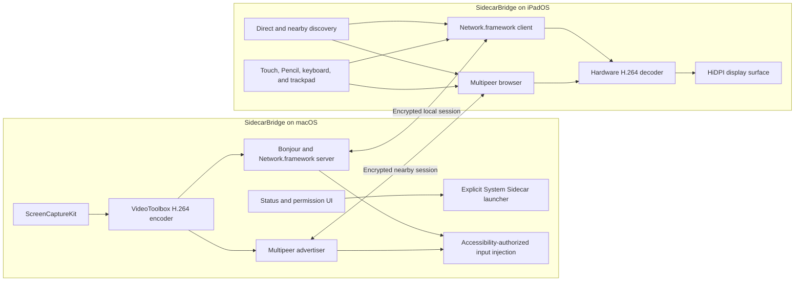

# SidecarBridge Technical Guide

This document is the implementation, operation, testing, and troubleshooting reference for SidecarBridge. It describes the paired native macOS and iPadOS application as of **Build 1** on 2026-07-19.

## 1. Purpose

SidecarBridge makes an iPad usable as a low-latency Mac screen and input surface when Apple's normal Sidecar discovery is unreliable.

It provides two deliberately separate experiences:

1. **In-App Display** mirrors the Mac's main display inside SidecarBridge on iPad. It uses public screen-capture, video, local-network, and input APIs. This mode supports the iPad Magic Keyboard, trackpad, touch, and Apple Pencil as remote input.
2. **System Sidecar** asks macOS to open Apple's native Sidecar session. It provides a true virtual Retina display, but Apple presents it in the separate system Continuity experience rather than inside the iPad app.

SidecarBridge never pretends that native Sidecar can be embedded in a third-party app. It keeps the public in-app transport and private native Sidecar launcher visibly separate.

## 2. Confirmed working state

The current project has the following identity:

| Property | Value |
| --- | --- |
| App name | `SidecarBridge` |
| macOS target | `SidecarBridgeMac` |
| iPadOS target | `SidecarBridgePad` |
| Shared bundle ID | `io.sidecarbridge.mac` |
| Marketing version | `0.1.0` |
| Build number | `1` |
| macOS minimum | macOS 14 |
| iPadOS minimum | iPadOS 17 |

The macOS and iPadOS targets intentionally use the same app name and bundle ID so App Store Connect can represent them as one multi-platform app record. Their target names differ only inside Xcode.

The latest live verification confirmed:

- both targets compile;
- the Mac app is signed and runs from `/Volumes/D/Applications/SidecarBridge.app`;
- direct Bonjour service publication is visible on active interfaces;
- the nearby advertisement remains continuously active instead of being cycled on an idle timer;
- when Bonjour results were absent on the iPad, its fixed-port probe reached both Mac interfaces;
- the Mac preserved the first handshake, rejected the duplicate interface arrival, and established the encrypted stream;
- the iPad displayed the live Mac screen over the same-Wi-Fi direct path;
- all 14 protocol and chunked-transfer tests pass.

## 3. High-level architecture



## 4. Connection strategy

SidecarBridge prioritizes a stable direct local connection while retaining a nearby fallback.

### 4.1 Direct local connection

The Mac starts `MacLANService`, which:

- creates a Network.framework TCP listener;
- binds the encrypted direct listener to TCP port `45454`;
- publishes `_sb-direct._tcp` through Bonjour;
- includes peer-to-peer interfaces so AWDL can participate;
- accepts a single active iPad connection;
- requests one-time pairing approval for an unfamiliar iPad device name.

The iPad starts `PadLANService`, which:

- browses for `_sb-direct._tcp` immediately;
- uses both same-Wi-Fi and peer-to-peer-capable routes;
- cycles through discovered endpoints;
- times out stale connection attempts after seven seconds;
- rebuilds an empty Bonjour browser after a stable 30-second discovery window;
- tries the last successful private Mac IPv4 address before a full subnet scan;
- probes only port `45454` across the iPad's private local `/24` when Bonjour is ready but empty;
- reconnects automatically after a connection ends.

The fixed-port probe is a discovery fallback for access points that filter multicast DNS while still allowing ordinary device-to-device TCP. It does not weaken the protocol: the Mac still requires the Curve25519 handshake and remembered or explicit pairing approval before accepting control or video traffic. Probes are batched, time-bounded, restricted to private IPv4 addresses on active Ethernet-style interfaces, and stopped immediately after one path succeeds.

Macs can expose the same listener through Ethernet, Wi-Fi, and AWDL at once. The listener keeps the first active handshake and rejects duplicate arrivals. Replacing the first candidate with a nearly simultaneous second connection previously caused a two-interface cancellation race.

### 4.2 Nearby fallback

If direct LAN has not connected, the Mac and iPad start Multipeer Connectivity after a short delay:

- the Mac advertises `_sb-screen._tcp` with role `mac`;
- the iPad browses and invites a discovered Mac;
- the MCSession requires encryption;
- a 12-second watchdog resets an actual stalled handshake;
- healthy advertiser and browser objects stay active continuously;
- a real failure, interface transition, foreground return, or explicit retry rebuilds discovery.

Earlier builds periodically restarted healthy advertisement and browsing objects. That created repeated service gaps and could make devices on the same Wi-Fi miss each other indefinitely. Healthy discovery now remains stable; only a confirmed failure or lifecycle event triggers recovery.

Both transports exchange an encrypted ping/pong every four seconds. The apps expose the measured round-trip time, consider a link stale after 12 seconds without peer traffic, and rebuild only the failed direct or nearby path. The iPad also sends an immediate validation ping after foregrounding so a socket retained across suspension cannot remain falsely marked connected.

### 4.3 System Sidecar

Native Sidecar is never launched automatically. The user must explicitly select **Open System Sidecar**.

`SidecarConnector` dynamically loads:

```text
/System/Library/PrivateFrameworks/SidecarCore.framework/SidecarCore
```

It lists Sidecar-capable devices and requests a wired or wireless connection. This private-framework path is for personal development or sideloaded use. It is not suitable for Mac App Store review.

## 5. Encrypted LAN protocol

The direct path uses a small framed protocol in `Shared/LANProtocol.swift`.

### 5.1 Handshake

1. The iPad generates an ephemeral Curve25519 key pair.
2. It sends a client hello containing its device name and public key.
3. The Mac asks the user to approve an unfamiliar iPad name.
4. The Mac generates its own ephemeral Curve25519 key pair.
5. Both peers derive the same 256-bit session key using Curve25519 key agreement and HKDF-SHA256.
6. The Mac returns its public key in the server hello.
7. All subsequent control and video packets use ChaChaPoly authenticated encryption.

The HKDF salt binds both public keys and the protocol label `SidecarBridge-LAN-v1`. The shared information label is `screen-and-input`.

### 5.2 Framing

Each network message uses:

```text
4-byte big-endian payload length
payload bytes
```

The maximum payload is 12 MiB. The parser supports partial packets, multiple packets in one read, and incomplete tails retained for the next read.

### 5.3 Packet types

The shared packet codec supports:

- JSON control messages;
- JPEG frames retained for compatibility;
- structured H.264 frames containing sequence, dimensions, keyframe state, parameter sets, and encoded sample bytes.

### 5.4 Trust boundary

Encryption protects packet confidentiality and integrity. Pairing approval prevents silent first contact, but the remembered peer name is a convenience identifier rather than a cryptographic device identity. Use SidecarBridge on a trusted local network.

## 6. Video pipeline

### 6.1 Capture

`ScreenStreamer` uses ScreenCaptureKit to capture the main macOS display. The Mac must have Screen Recording permission.

### 6.2 Encoding

`H264Encoder` uses VideoToolbox hardware encoding. The target profile is designed for an iPad display:

- native-width-aware HiDPI output;
- width clamped to a practical 1440–2880-pixel range;
- up to 30 frames per second;
- transport-specific bitrate and frame pacing;
- automatic 15 fps pacing while the iPad viewer is in background PiP, restored on foreground return;
- periodic keyframes for recovery.

### 6.3 Flow control

The Mac never allows old frames to create an ever-growing latency queue:

- only a small frame burst is buffered;
- the iPad acknowledges displayed video sequence numbers;
- the Mac sends the next frame after acknowledgement;
- if the queue saturates, dependent frames are discarded;
- transmission resumes at the next keyframe;
- initial keyframes are retried after the iPad display layer becomes ready.

### 6.4 Decoding and display

The iPad uses a hardware-backed H.264 display path. It tracks stream dimensions, frame rate, current transport, Picture in Picture availability, and whether a usable first frame has arrived.

The fallback mirrors the Mac's main display. It does not create a virtual extended desktop. Native Sidecar is still required for a true extra Retina display.

## 7. Remote input

The iPad can forward:

- pointer movement and hover;
- distinct primary, primary double-click, and secondary click events;
- click-and-drag with explicit down, drag, and up phases;
- wheel and continuous scrolling;
- two-finger touch scrolling;
- direct touch and Apple Pencil positions;
- typed text;
- arrows, Return, Tab, Escape, Delete, and common Command shortcuts.

The Mac converts the normalized coordinates to the captured display and posts CGEvents. This requires explicit Accessibility permission in macOS System Settings.

A single primary tap is delayed until the double-tap recognizer fails, so a double-click cannot also produce an accidental single click. macOS receives a dedicated double-click event and emits two left-button down/up pairs with click-state values 1 and 2. The viewer drawer provides separate **Left**, **Double**, and **Right** controls at the current pointer position for users who prefer explicit buttons.

The viewer also supports DeskIn-style navigation without changing remote input semantics:

- two-finger translation remains remote macOS scrolling;
- a two-finger pinch changes local viewer magnification between 100% and 400%;
- a three-finger drag pans the magnified viewport;
- the inverse zoom transform is applied before normalizing pointer coordinates, keeping clicks aligned with visible targets.

The iPad UI includes an AnyDesk-style right-edge control drawer for:

- virtual cursor visibility;
- click feedback;
- top status bar visibility;
- bottom help visibility;
- Picture in Picture;
- explicit left-click, double-click, and right-click buttons;
- zoom step, reset, and current zoom controls;
- encrypted file-transfer progress and file selection;
- input permission and latency status;
- stopping the stream.

### 7.1 File transfer

`FileTransferEngine` sends files in either direction over the active paired transport. Each 128 KB chunk is acknowledged before the next chunk is read, bounding memory and preventing a large transfer queue from starving video or input. Transfers are limited to 512 MB, validate offsets and sizes, sanitize destination names, and use the existing authenticated encryption layer. The Mac saves received files in `Downloads/SidecarBridge Transfers`; the iPad stores them in its Documents container and exposes the system share sheet.

## 8. Permission model

### 8.1 macOS

| Permission or capability | Purpose |
| --- | --- |
| App Sandbox | Required for Mac App Store validation |
| Network client | Outgoing local and peer connections |
| Network server | Incoming Bonjour/TCP connections |
| Downloads read/write | Save files explicitly received from the paired iPad |
| USB device access | Detect a trusted wired iPad |
| Local Network | Bonjour and nearby discovery |
| Screen Recording | Capture the Mac display |
| Accessibility | Inject keyboard, pointer, click, drag, and scroll events |
| Login Item | Optional user-controlled automatic startup |

The app cannot add itself to Screen Recording or Accessibility. The user must approve those permissions.

### 8.2 iPadOS

| Permission or capability | Purpose |
| --- | --- |
| Local Network | Browse and connect to the Mac on Bonjour/AWDL |
| Bonjour declarations | Advertised service types `_sb-direct._tcp` and `_sb-screen._tcp` |
| Background audio mode | Supports the app's background media/Picture in Picture behavior |

Changing the bundle ID creates a new Local Network permission identity. If discovery worked before a bundle-ID change and then stops, open **Settings → Apps → SidecarBridge → Local Network** and enable it again.

## 9. Background behavior

On macOS, closing the main window does not terminate SidecarBridge. It remains available through its menu bar item so the iPad can reconnect. Automatic startup is opt-in and can be repaired if the app moves.

On iPadOS:

- automatic Picture in Picture is enabled by default for the live viewer and starts when the user switches apps;
- the app activates its playback audio session, invalidates PiP playback state, and reports ready, starting, active, suspended, and failed states in the control drawer;
- a short system background task protects the connection while PiP is starting;
- a three-second PiP start watchdog clears a stuck start, and the model retries up to three times;
- the encrypted connection is validated when the app becomes active, with discovery rebuilt only if the route is stale;
- the Mac lowers capture pacing to 15 fps during PiP and restores the transport's foreground rate on return;
- if PiP is unavailable, disabled, or dismissed, iPadOS can suspend the ordinary app after the grace period.

## 10. Project layout

| Path | Responsibility |
| --- | --- |
| `project.yml` | XcodeGen targets, identity, versions, capabilities, and frameworks |
| `Mac/SidecarBridgeMacApp.swift` | macOS app lifecycle and menu bar entry |
| `Mac/MacConnectionModel.swift` | Mac connection, permission, startup, and stream state |
| `Mac/MacPeerService.swift` | Direct/P2P selection and Multipeer advertiser |
| `Mac/MacLANService.swift` | Encrypted direct TCP listener and pairing |
| `Mac/ScreenStreamer.swift` | ScreenCaptureKit capture |
| `Mac/H264Encoder.swift` | VideoToolbox H.264 encoding |
| `Mac/RemoteInputController.swift` | Accessibility checks and CGEvent injection |
| `Mac/SidecarConnector.swift` | Explicit private SidecarCore launcher |
| `Mac/CableDetector.swift` | USB iPad detection through IOKit |
| `Pad/SidecarBridgePadApp.swift` | iPadOS app lifecycle |
| `Pad/PadConnectionModel.swift` | Discovery, display, input, and background state |
| `Pad/PadPeerService.swift` | Direct/P2P selection and Multipeer browser |
| `Pad/PadLANService.swift` | Encrypted direct client and recovery |
| `Pad/PadContentView.swift` | Discovery, streaming, permission, and control UI |
| `Pad/VideoDisplaySurface.swift` | Hardware video display and Picture in Picture |
| `Pad/RemoteInputSurface.swift` | Touch, Pencil, pointer, keyboard, and gesture input |
| `Shared/BridgeProtocol.swift` | Control messages, input events, packets, video metadata, and file chunks |
| `Shared/FileTransferEngine.swift` | Bidirectional chunk flow control, validation, and received-file storage |
| `Shared/LANProtocol.swift` | Encrypted handshake and TCP framing |
| `Tests/PacketCodecTests.swift` | Protocol, file transfer, framing, encryption, permission, drag, and input tests |
| `scripts/build.sh` | Reproducible local Mac/iPad builds and Mac tests |

## 11. Build entirely on `/Volumes/D`

This workspace must not intentionally place project data, build output, archives, temporary artifacts, or installed development copies on the main disk.

Requirements:

- Xcode 16 or newer;
- XcodeGen;
- an Apple development team for device signing;
- a trusted iPad with Developer Mode enabled for direct development installation.

Generate and test:

```sh
cd /Volumes/D/github/sidecar
./scripts/build.sh
```

Open the project with the Xcode installation on `/Volumes/D`:

```sh
/Volumes/D/Xcode.app/Contents/MacOS/Xcode \
  /Volumes/D/github/sidecar/SidecarBridge.xcodeproj
```

Use explicit derived-data paths for additional builds:

```sh
DEVELOPER_DIR=/Volumes/D/Xcode.app/Contents/Developer \
  /usr/bin/xcodebuild \
  -project /Volumes/D/github/sidecar/SidecarBridge.xcodeproj \
  -scheme SidecarBridgeMac \
  -derivedDataPath /Volumes/D/xcode/SidecarBridgeMac-DerivedData \
  build
```

The development Mac app belongs at:

```text
/Volumes/D/Applications/SidecarBridge.app
```

macOS itself can still create unavoidable small permission records, preferences, unified logs, or sandbox metadata on the system disk. Project-controlled artifacts remain on `/Volumes/D`.

## 12. App Store Connect and distribution

### 12.1 Multi-platform identity

Both targets use `io.sidecarbridge.mac`. App Store Connect associates uploads by bundle ID and version. Add iOS to the existing SidecarBridge app record instead of creating a second app.

### 12.2 Sandbox

The Mac executable includes:

```text
com.apple.security.app-sandbox = true
com.apple.security.network.client = true
com.apple.security.network.server = true
com.apple.security.device.usb = true
```

### 12.3 Privacy manifest

The iPad target contains `PrivacyInfo.xcprivacy`, declaring required-reason access for UserDefaults and system boot time. The app declares no tracking and no collected data in that manifest.

### 12.4 Encryption export declaration

Both Info.plists set:

```xml
<key>ITSAppUsesNonExemptEncryption</key>
<false/>
```

The app uses Curve25519, ChaChaPoly, and HKDF-SHA256 through Apple's CryptoKit. The key means the app does not use **non-exempt** encryption; it does not mean that network traffic is unencrypted.

### 12.5 Private API warning

The public in-app transport is built from ScreenCaptureKit, VideoToolbox, Network.framework, Multipeer Connectivity, CryptoKit, and documented UI/input facilities.

The explicit System Sidecar launcher uses private `SidecarCore` selectors. Apple requires App Store apps to use public APIs. A production App Store build should compile out or remove the private launcher before review. Personal Xcode-signed builds may retain it at the developer's own risk.

## 13. Troubleshooting

### 13.1 iPad cannot find the Mac

Check in this order:

1. Confirm the current Mac app is open and both apps are the intended build.
2. On iPad, enable **Settings → Apps → SidecarBridge → Local Network**.
3. Keep Wi-Fi and Bluetooth enabled on both devices.
4. Confirm both devices are on the same non-isolated LAN. Guest Wi-Fi often blocks client-to-client traffic.
5. Tap **Search Again** in the iPad recovery panel.
6. Verify the Mac advertises the direct service:

   ```sh
   /usr/bin/dns-sd -B _sb-direct._tcp local.
   ```

7. Verify the nearby fallback advertisement:

   ```sh
   /usr/bin/dns-sd -B _sb-screen._tcp local.
   ```

8. Confirm the Mac firewall allows SidecarBridge.
9. If installing from Xcode, unlock the iPad, trust the Mac, enable Developer Mode, and reconnect once by cable.

Do not interpret the Mac's **READY** or **STANDBY** state as a failed connection. Those states mean it is ready for an iPad. **CONNECTING**, **ACTIVE**, and **RECOVERING** describe actual transport work.

### 13.2 Connection stalls at P2P transfer

- Prefer the direct LAN path when available.
- Confirm the iPad reports `Direct local link / AWDL` rather than nearby fallback.
- Reopen both apps to clear an old MCSession.
- Check whether a pairing alert is waiting behind another Mac window.
- Inspect logs for a real 12-second handshake timeout. Idle advertisements should no longer reset at that interval.

### 13.3 Connection succeeds but the screen does not update

- Grant Screen Recording on the Mac and restart the Mac app.
- Wait for the first H.264 keyframe.
- Use the iPad retry action to request a fresh keyframe.
- Confirm the iPad display layer is active and not covered by the discovery UI.
- Check stream FPS and transport status in the top bar or right-side drawer.

### 13.4 Click works but pointer, drag, or scroll does not

- Enable SidecarBridge under macOS Accessibility.
- Confirm the Mac app shows the input permission as passed.
- Re-add the current app path if the app moved or was rebuilt.
- Make sure pointer down, drag, and up events all reach the Mac; a missing up event can leave the drag state stuck.
- Check the iPad input-latency indicator and virtual cursor overlay.

### 13.5 Native Sidecar does not list the iPad

Native Sidecar additionally requires compatible hardware, the same Apple Account with two-factor authentication, Handoff, Wi-Fi, Bluetooth, and a trusted cable for USB operation. SidecarBridge's in-app mode can still work when Apple's device list is empty because it has its own local transport.

## 14. Tests

`PacketCodecTests` currently covers 15 cases:

1. control-message round trip;
2. heartbeat-message round trip;
3. H.264 frame round trip;
4. JPEG frame round trip;
5. file-packet round trip;
6. multi-chunk file-transfer round trip;
7. empty packet rejection;
8. multiple LAN frames in one read;
9. partial LAN frame handling;
10. complete frame plus incomplete-tail preservation;
11. LAN key agreement and encryption;
12. non-optimistic local-network permission states;
13. remote drag round trip;
14. general remote input round trip;
15. left-click, double-click, and right-click protocol round trips.

Run them with all output on `/Volumes/D`:

```sh
DEVELOPER_DIR=/Volumes/D/Xcode.app/Contents/Developer \
  /usr/bin/xcodebuild \
  -project /Volumes/D/github/sidecar/SidecarBridge.xcodeproj \
  -scheme SidecarBridgeMac \
  -destination 'platform=macOS,arch=arm64' \
  -derivedDataPath /Volumes/D/xcode/SidecarBridgeTests \
  CODE_SIGN_IDENTITY=- \
  test
```

## 15. Known limitations

- Native Sidecar cannot appear inside SidecarBridge on iPad.
- The public fallback mirrors the main display rather than adding an extended display.
- The private Sidecar launcher is not App Store-safe.
- Peer-name persistence is weaker than certificate-backed device identity.
- There is no public-Internet relay or cloud rendezvous service.
- Guest Wi-Fi/client isolation can prevent direct same-LAN communication.
- iPadOS controls background execution and can suspend the app outside approved modes.
- Screen Recording and Accessibility always require explicit user approval.

## 16. Release checklist

Before publishing a new build:

1. Confirm the marketing version and monotonically increasing build number.
2. Regenerate `SidecarBridge.xcodeproj` with XcodeGen.
3. Build both targets from clean derived-data directories on `/Volumes/D`.
4. Run all protocol tests.
5. Confirm both final bundles have the same app name and bundle ID.
6. Verify the Mac executable contains the sandbox and network entitlements.
7. Verify the iPad bundle contains `PrivacyInfo.xcprivacy`.
8. Verify `ITSAppUsesNonExemptEncryption` is `false` in both final Info.plists.
9. Test direct same-Wi-Fi discovery, nearby fallback, encrypted handshake, first video frame, click, drag, scroll, and keyboard input.
10. Confirm the Mac advertisement stays stable past 12 seconds while idle.
11. Remove or compile out private SidecarCore behavior for an App Store review build.
12. Keep archives, exports, verification folders, and installed development copies on `/Volumes/D`.
